<h1>Trabalho Final Sistemas Distribuídos

<sub>Servidor Chave - Valor em GO</sub></h1>
- Lucas Sabbatini Janot Procópio
- Pedro Martins Luiz Simoni
- João Caio Pereira Melo
- Gustavo Mascarenhas Amorim


## Visão Geral da Arquitetura



- **Comunicação Cliente-Nó (gRPC)**: Clientes interagem com qualquer nó no cluster usando gRPC para realizar operações de Put (escrita) e Get (leitura).
- **Comunicação Nó-Nó (MQTT)**: Os nós usam um broker MQTT para difundir atualizações (replicar dados) para todos os outros nós inscritos. Isso permite uma propagação de dados assíncrona e desacoplada.

---

## 1. O que é o arquivo `.proto`?

* O arquivo `.proto` é um **contrato de comunicação** entre cliente e servidor usando **Protocol Buffers (Protobuf)**.
* Nele definimos os "endpoints" da nossa aplicação porém não estamos lidando com o protocolo REST e sim o gRPC. Além disso temos as estruturas de classes essênciais neste projeto como **VectorClockEntry**, **VectorClock**, **Version**, **PutRequest** e **GetRequest**.
* Esse arquivo é **independente de linguagem**: a partir dele, o compilador `protoc` gera código Go, Python, Java ou Rust, conforme necessário.

## 2. O que são os arquivos na pasta `pkg/kvstore`

Depois de rodar o `protoc`, temos dois arquivos principais:

### 🔹 `kv_store.pb.go`

* Define as **estruturas de dados** (mensagens Protobuf).
* Exemplos:

  * `PutRequest`, `PutResponse`
  * `GetRequest`, `GetResponse`
  * `Version`, `VectorClock`, `VectorClockEntry`
* Contém getters, metadados e suporte de serialização para o Protobuf.

### 🔹 `kv_store_grpc.pb.go`

* Define as **interfaces do serviço gRPC**.
* Inclui:

  * `KvStoreClient` → usado pelo cliente para chamar `Put` e `Get`.
  * `KvStoreServer` → interface que o servidor precisa implementar.
* Em resumo: **cola o gRPC ao Go**, permitindo implementar servidor e cliente.

## 3. O que foi e o que não foi implementado

Foram implementados todos os requisitos básicos do projeto. O foco era na resolução de conflitos e identificação de verões concorrentes. Isso foi implementado.

Não foi implementado algoritimos complexos de consenso ou replicação. Cada nó escreve seu `StoreEntry` em um tópico. Dessa forma, seria possível implementar esses algoritmos neste caso.

## 4. Etapas para Compilar e Executar

### Passo 1 - Criar o broker Mosquitto
```bash
docker-compose up -d
```

### Passo 2 — Baixar dependências

```bash
go mod tidy
```

### Passo 3 — Compilar servidor e cliente

```bash
go build -o server/bin/server ./server
go build -o client-test/bin/client ./client-test
```

### Passo 4 — Executar

Em um terminal, inicie o servidor:

```bash
# Iniciar na porta padrão (50051)
./server/bin/server

# Ou em uma porta específica
./server/bin/server -listen-addr 127.0.0.1:50052

# Exemplo completo: Iniciar um nó customizado
# - Com um ID específico
# - Em uma porta gRPC diferente
# - Apontando para um broker MQTT em outro endereço
./server/bin/server -node-id "node-A" -listen-addr "127.0.0.1:50052" -mqtt-broker-addr "192.168.1.10" -mqtt-broker-port 1883
```

### Alternativa

Primeiramente conceda os privilégios corretos para os scripts:

```bash
chmod +x compile.sh
chmod +x server.sh
```

Para compilar e rodar um servidor, rode ambos scripts:
```bash
# Compilação
./compile.sh

# Iniciar na porta padrão (50051)
./server.sh

# Ou em uma porta específica
./server.sh -listen-addr 127.0.0.1:50052

# Exemplo completo: Iniciar um nó customizado
# - Com um ID específico
# - Em uma porta gRPC diferente
# - Apontando para um broker MQTT em outro endereço
./server.sh -node-id "node-A" -listen-addr "127.0.0.1:50052" -mqtt-broker-addr "192.168.1.10" -mqtt-broker-port 1883
```

#### Executando o Cliente

O cliente de teste pode ser usado para enviar comandos put e get para o servidor. Abra um novo terminal para executar os comandos do cliente.

Comando put:

Para inserir ou atualizar um par chave-valor, use o subcomando put. As flags -key e -value são obrigatórias.
Bash

```bash

./client-test/bin/client put -key="minha-chave" -value="meu-valor"
```

# Para se conectar a um servidor em um endereço diferente
```bash
./client-test/bin/client put -addr="localhost:50052" -key="outra-chave" -value="outro-valor"
```

Comando get:

Para buscar os valores associados a uma chave, use o subcomando get. A flag -key é obrigatória.
Bash
```bash
./client-test/bin/client get -key="minha-chave"
```

## 5. Principais dificuldades encontradas

A principal dificuldade encontrada é de orquestrar a escrita de diferentes versões em um tópico e a propagação de todo o StoreEntry de um servidor no broker MQTT.

Como comparar o `StoreEntry` recebido em um tópico com o `StoreEntry` local e como decidir quais versões irão acionar a função `process_put`.

Uma nova versão recebida sobreescreve todas as versões antigas do Store para aquela key.

## 6. Detalhamento das estruturas de dados que armazenam as chaves/valores/versões

### NodeState

**Arquivo de Definição**: server/src/node_state.go

**Propósito**: É a estrutura de mais alto nível que representa o estado completo de um único nó (servidor) no cluster. Ela serve como o contêiner principal para o armazenamento de dados em memória.

**Campos**:
  * ***Node_id (string)***: Um identificador único para o nó (ex: "node-A" ou um UUID gerado). Este ID é crucial para rastrear qual servidor originou uma escrita no VectorClock.
  * ***Store (map[string]StoreEntry)***: O coração do armazenamento. É um mapa Go onde a chave é a key (string) que o cliente deseja armazenar (ex: "cidade"), e o valor é um objeto StoreEntry que contém todas as informações e versões associadas a essa chave.

### StoreEntry

**Arquivo de Definição**: server/src/node_state.go

**Propósito**: Representa todos os dados associados a uma única chave dentro do Store.

**Campos**:
  * ***Key (string)***: A chave à qual esta entrada se refere (ex: "cidade"), replicando a chave do mapa para fácil serialização.
  * ***Versions ([]\*pb.Version)***: Uma lista (slice em Go) que contém todas as versões ativas para esta chave. Em um sistema de consistência eventual, pode haver mais de uma versão ativa se ocorrer um conflito (versões concorrentes). Se uma versão for uma atualização causal de outra, a antiga é descartada e apenas a nova permanece nesta lista.

### Version

**Arquivo de Definição**: proto/kv_store.proto

**Propósito**: Representa uma única instância ou valor de um dado em um determinado ponto no tempo. É o item fundamental na lista Versions.

**Campos**:
  * ***value (string)***: O dado real que o cliente armazenou (ex: "uberlandia").
  * ***vector_clock (VectorClock)***: O relógio vetorial associado a esta versão específica. É a estrutura de metadados que rastreia o histórico causal e permite a detecção e resolução de conflitos.
  * ***timestamp (uint64)***: Um timestamp em nanossegundos (desde a Época Unix) que marca o momento da criação da versão. É usado para inicializar o contador do VectorClock e pode servir como um mecanismo de desempate.
  * ***writer_node_id (string)***: O Node_id do servidor que originalmente criou esta versão.

### VectorClock

**Arquivo de Definição**: proto/kv_store.proto

**Propósito**: É a estrutura de dados que torna a resolução de conflitos possível. Ele rastreia o "conhecimento" que uma versão tem sobre as atualizações feitas em outros nós, estabelecendo uma ordem causal parcial entre as versões.

**Implementação**: É representado como uma lista de VectorClockEntry, onde cada entrada corresponde a um nó do sistema.

**VectorClockEntry**: Contém dois campos: ***node_id*** (o ID de um nó) e ***counter*** (um contador, que no nosso caso é o timestamp da última atualização vista daquele nó). Ao comparar dois VectorClocks, o sistema pode determinar se uma versão aconteceu antes, depois ou concorrentemente a outra.
